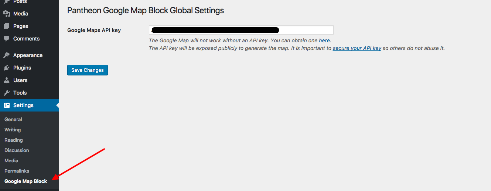

# Map Embed Gutenberg Block for Google Maps By Pantheon
This WordPress plugin provides a Google Maps embed block for the [Gutenberg WordPress editor](https://github.com/WordPress/gutenberg). 

## Installation
The Map Embed Gutenberg Block for Google Maps By Pantheon plugin can be installed just like you would install any other WordPress plugin. To install from GitHub simply [download the `.zip`](https://github.com/pantheon-systems/google-map-gutenberg-block/archive/master.zip) file. You can then either unzip it and add it to your plugins folder _or_ upload the `.zip` file when adding a new plugin in the WordPress dashboard.

Because Google Map embes require an API key you'll need to provide a valid API key in plugin settings as well. See the detailed steps below.
 
1. Install and activate the Gutenberg plugin if you are on a WordPress version <= `5.0`
1. Search for 'embed-gutenberg-block-google-maps' when adding a new plugin in the WordPress dashboard **or** upload the plugin files manually to the `/wp-content/plugins/` directory
1. Activate the plugin through the 'Plugins' menu in WordPress
1. Obtain a [Google Map embed API key](https://developers.google.com/maps/documentation/embed/get-api-key)
1. Visit the plugin settings page and enter/save your Google Map embed API key
1. Clear full page cache if enabled for your site so the API key can be read from the plugin settings via the REST API
1. Search for _Google Map_ when adding a new content block
1. Enter a location for the map. This can be an exact address for a queryable location, such as _New York, NY_
1. Optionally edit the advanced block settings

## API Key
This plugin requires an API key to interact with Google Maps. Without an API key maps will not be displayed.

To obtain an API key follow these steps:
1. Create a [new project in the Google Developer's console](https://console.developers.google.com/projectcreate)
1. Open [the API library](https://console.developers.google.com/apis/library)
1. Search for "map embed"
1. Select _Google Maps Embed API_ and enable the API
1. Go back to [the API library](https://console.developers.google.com/apis/library)
1. Search for "map embed"
1. Select _Google Static Maps API_ and enable the API
1. Go to [Credentials](https://console.developers.google.com/apis/credentials)
1. Click _Create credentials > API Key_
1. Save the API key shown in a safe place
1. Click _Restict Key_
1. Select _HTTP referrers (web sites)_  for the _Key restriction_ type
1. Enter the domains where your API key will be used
    - Example: `*.mysite.com`
1. Enter the API key into the plugin settings
1. Clear full page caching, if necessary

Note: The API key will be exposed publicly to generate the map. It is important to [restrict your API key](https://developers.google.com/maps/documentation/embed/get-api-key#key-restrictions) so others do not abuse it. The API key will be used, and displayed, in both the WordPress editor and the front end of the site.

## Use
Once you have saved an API key into the plugin settings simply enter a location, such as New York, NY, or a full address. You may also choose the map width, height, zoom level and toggle between an interactive map or a static image in the block settings, which are visible in the right-hand sidebar when the block is selected.

